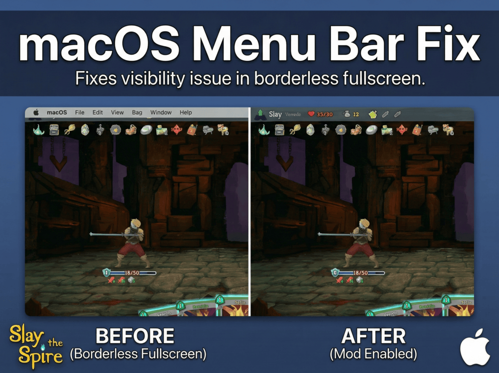

# macOS Menu Bar Fix for Slay the Spire



A mod for [Slay the Spire](https://store.steampowered.com/app/646570/Slay_the_Spire/) that fixes the macOS menu bar visibility issue when playing in borderless fullscreen mode.

---

## 🖥️ About / 关于

**English:**
On macOS, when using "Borderless Fullscreen" mode, the system menu bar remains visible and covers the HP bar and relics at the top of the screen. This mod hides the menu bar while playing, so you get a clean fullscreen view without losing the convenience of Cmd+Tab switching.

**中文：**
在 macOS 上使用「无边框全屏」模式时，系统菜单栏会一直显示，遮挡住屏幕顶部的血条和遗物。这个 Mod 会在游戏时隐藏菜单栏，让你获得干净的全屏画面，同时保留 Cmd+Tab 快速切换的便利。

---

## Features / 功能

- Automatically hides menu bar & dock when game is focused / 游戏时自动隐藏菜单栏和 Dock
- Menu bar reappears when you move mouse to top / 鼠标移到顶部时菜单栏会短暂出现
- Returns to normal when you quit or switch apps / 退出或切换应用时恢复正常
- Only activates on macOS with Borderless Fullscreen / 仅在 macOS + 无边框全屏下生效

## Installation

### Requirements

- Slay the Spire (Steam version)
- [ModTheSpire](https://github.com/kiooeht/ModTheSpire)
- [BaseMod](https://github.com/daviscook477/BaseMod)

### Steps

1. Download the latest `MacOSMenuBarFix-x.x.x.jar` from the [Releases](../../releases) page
2. Copy the JAR file to your Slay the Spire mods folder:
   ```bash
   cp MacOSMenuBarFix-1.0.0.jar ~/Library/Application\ Support/Steam/steamapps/common/SlayTheSpire/mods/
   ```
3. Launch the game using ModTheSpire
4. Enable "macOS Menu Bar Fix" in the mod list
5. In game settings, enable "Borderless Fullscreen" mode

## How It Works

This mod uses [JNA (Java Native Access)](https://github.com/java-native-access/jna) to call macOS Cocoa APIs directly from Java:

1. **Objective-C Runtime Access**: Uses JNA to load the `objc` library and call Objective-C runtime functions (`objc_getClass`, `sel_registerName`, `objc_msgSend`)

2. **NSApplication API**: Gets the shared `NSApplication` instance and calls `setPresentationOptions:` with:

   - `NSApplicationPresentationAutoHideMenuBar` (1 << 2)
   - `NSApplicationPresentationAutoHideDock` (1 << 0)

3. **Shutdown Hook**: Registers a JVM shutdown hook to restore default presentation options when the game exits, ensuring the menu bar returns to normal even if the game crashes

## Building from Source

### Requirements

- Java 8 (JDK 1.8)
- Maven 3.x

### Setting Up Dependencies

The `lib/` directory is not included in the repository. You need to manually copy the required JAR files from your Steam installation:

```bash
# Create lib directory
mkdir -p lib

# Copy game JAR (Slay the Spire)
cp ~/Library/Application\ Support/Steam/steamapps/common/SlayTheSpire/desktop-1.0.jar lib/

# Copy BaseMod from Steam Workshop
# (The workshop ID for BaseMod is 1605833019)
cp ~/Library/Application\ Support/Steam/steamapps/workshop/content/646570/1605833019/BaseMod.jar lib/

# Copy ModTheSpire from Steam Workshop
# (The workshop ID for ModTheSpire is 1605060445)
cp ~/Library/Application\ Support/Steam/steamapps/workshop/content/646570/1605060445/ModTheSpire.jar lib/
```

> **Note**: Workshop IDs may vary. You can find BaseMod and ModTheSpire by browsing the workshop content directory, or by checking the mod's Steam Workshop page URL.

After copying, your `lib/` directory should contain:

- `desktop-1.0.jar` - Slay the Spire game
- `BaseMod.jar` - BaseMod library
- `ModTheSpire.jar` - ModTheSpire loader

### Build Commands

```bash
# Compile only
mvn clean compile

# Build JAR with dependencies and copy to workshop
mvn clean package
cp target/MacOSMenuBarFix-1.0.0.jar workshop/content/MacOSMenuBarFix.jar
```

### Publishing to Steam Workshop

The `workshop/` directory is generated by the official [mod-uploader.jar](https://github.com/kiooeht/ModTheSpire/wiki/Steam-Workshop) tool. It contains:

- `config.json` - Workshop metadata (title, description, tags)
- `content/` - Mod JAR files to upload
- `image.jpg` - Preview image for the Workshop page
- `README.md` - Workshop-specific readme

To upload the mod to Steam Workshop:

```bash
# First, copy the built JAR to workshop/content/
cp target/MacOSMenuBarFix-1.0.0.jar workshop/content/MacOSMenuBarFix.jar

# Then upload using mod-uploader.jar
java -jar mod-uploader.jar upload -w workshop
```

### Project Structure

```
sts-macos-menubar-fix/
├── pom.xml                              # Maven config with JNA + shade plugin
├── src/main/java/macosmenubarfix/
│   ├── MacOSMenuBarFix.java            # Mod entry point
│   └── cocoa/
│       ├── ObjectiveCRuntime.java      # JNA interface for objc runtime
│       └── NSApplication.java          # NSApplication helper class
├── src/main/resources/
│   └── ModTheSpire.json                # Mod metadata
├── lib/                                 # Game dependencies (not in repo)
└── workshop/                            # Steam Workshop upload directory
    ├── config.json                      # Workshop metadata
    ├── content/                         # JAR files to upload
    └── image.jpg                        # Preview image
```

## License

MIT License

## Credits

- [ModTheSpire](https://github.com/kiooeht/ModTheSpire) - Mod loading framework
- [BaseMod](https://github.com/daviscook477/BaseMod) - Modding API
- [JNA](https://github.com/java-native-access/jna) - Java Native Access library
